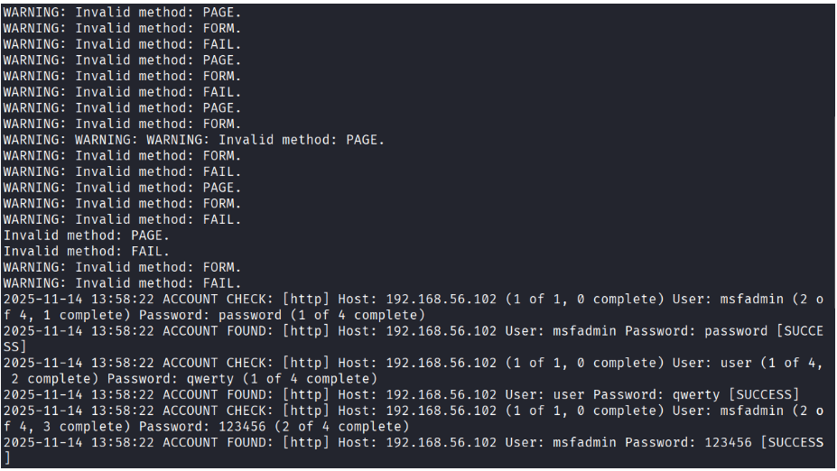

Simulação de Ataques de Força Bruta e Enumeração com Medusa, Nmap e Enum4Linux

Este repositório demonstra, de forma prática e didática, como funcionam ataques de enumeração, força bruta e password spraying em um ambiente controlado utilizando Kali Linux e Metasploitable. O foco é ensinar fundamentos essenciais de ataques ofensivos para estudantes de Cybersecurity.

### ⚠️ Observações

Este material é destinado exclusivamente a estudos em ambientes controlados. Nunca utilize estas técnicas contra sistemas sem autorização explícita.

### Arquitetura do ambiente

Host (VirtualBox)

 ├── Kali Linux (Atacante)
 
 └── Metasploitable 2 (Alvo: 192.168.56.102)

### Requisitos

- Software de Máquina Virtual (no caso será utilizado o VirtualBox, que você pode baixar clicando [aqui](https://www.virtualbox.org/wiki/Downloads)).
- VM Kali Linux (link para download [aqui](https://www.kali.org/get-kali/#kali-virtual-machines)).
- VM Metasploitable (link para download [aqui](https://sourceforge.net/projects/metasploitable/files/)).

### Credenciais

- Kali Linux: login e senha padrão → **kali**
- Metasploitable: login e senha padrão → **msfadmin**

### Técnicas utilizadas

- Password Spraying e Credential Stuffing

### Ataque de Enumeração

**1. Varredura com Nmap**

A primeira parte desta simulação é a enumeração, que consiste em descobrir quais serviços estão disponíveis no sistema alvo. Para isso é utilizado o comando **nmap**, que vai escanear as portas dos principais protocolos de rede como FTP, SSH, HTTP, HTTPS e SMB. O parâmetro **-sV** serve para identificar a versão do serviço que está rodando em cada porta:

Para isso, utilize o seguinte comando:

```bash
nmap -sV -p 21,22,80,445,139 192.168.56.102
```

Este comando vai mostrar qual o estado das portas como "**open**".


Se quiser validar se o protocolo FTP realmente está aberto, basta executar o comando:

```bash
ftp 192.168.56.102
```

**2. Wordlist**

Conforme a imagem anterior, sabemos que o serviço está aberto mas não temos como saber qual login e senha correto. Diante disso, vamos criar duas Wordlists, uma contendo nomes de usuários e outra contendo senhas. 
**Wordlists** são arquivos com usuários e senhas possíveis. Para isso vamos utilizar os seguintes passos abaixo:

Comando para criar lista de **usuários**:

```bash
echo -e “user\nmsfadmin\nadmin\nroot” > users.txt
```

Comando para criar lista de **senhas**:

```bash
echo -e “123456\npassword\nqwerty\nmsfadmin” > pass.txt
```

**3. Efetuando o ataque com Medusa**

Criadas as wordlists, agora é hora de executar o **Medusa**, que vai simular combinações entre usuários e senhas. O comando é:

```bash
medusa -h 192.168.56.102 -U users.txt -P pass.txt -M ftp -t 6
```

Explicando os parâmetros:
- `-h 192.168.56.102`: define o host alvo. É o endereço IP da máquina que você quer testar.
- `-U users.txt`: informa o arquivo que contém a lista de usuários que serão testados.
- `-P pass.txt`: informa o arquivo que contém a lista de senhas que serão testadas.
- `-M ftp`: define o módulo (protocolo/serviço) que será atacado. Aqui, o ataque é contra o serviço FTP.
- `-t 6`: define o número de threads simultâneas. Em outras palavras: quantas tentativas paralelas o Medusa fará ao mesmo tempo.

Após executar o comando procurar onde ele teve “**SUCCESS**” na investida, bem como as combinações de usuário e senha, conforme mostra a imagem abaixo:


Se tentar acessar agora a VM Metasploitable via protocolo FTP, e inserir as credenciais em que o Medusa obteve sucesso, vai obter êxito no ataque.

```bash
ftp 192.168.56.102
```

### Ataques de força bruta aplicados em formulários de login em sistemas web

Para testar essa ferramenta, utilizaremos um formulário web do próprio metasploitable para teste. Para acessar, abra um navegador e acesse através do seguinte endereço:

```bash
http://192.168.56.102/dvwa/login.php
```

**1. Criação de Wordlist**

Comando para criar lista de **usuários**:

```bash
echo -e “user\nmsfadmin\nadmin\nroot” > users.txt
```

Comando para criar lista de **senhas**:

```bash
echo -e “123456\npassword\nqwerty\nmsfadmin” > pass.txt
```

**2. Executar o ataque**

Agora, utilizar o Medusa para simular combinações entre usuários e senhas, através do comando:

```bash
medusa -h 192.168.56.102 -U users.txt -P pass.txt -M http \
 -m PAGE:'/dvwa/login.php' \
 -m FORM:'username=^USER^&password=^PASS^&Login=Login' \
 -m FAIL:'Login failed' \
 -t 6
```

Explicando os parâmetros:
- `-h 192.168.56.102`: endereço do alvo.
- `-U users.txt`: arquivo com logins.
- `-P pass.txt`: arquivo com senhas.
- `-M http`: módulo http, ou seja, aplicações web.
- `m PAGE:'/dvwa/login.php'`: caminho do formulário de login do servidor.
- `-m FORM:'username=^USER^&password=^PASS^&Login=Login'`: corpo da requisição.
- `-m FAIL:'Login failed'`: qual é a resposta pra tentativa de falha.
- `-t 6`: usa seis conexões simultâneas para acelerar o processo.

Onde está “**SUCCESS**” ele encontrou credenciais válidas:



Para validar, acesse com as seguintes credenciais de login: admin e senha: password.

### Ataque em cadeia, enumeração smb + password spraying

O protocolo **SMB** significa *Server Message Block*. É um protocolo do Windows utilizado para compartilhar arquivos, pastas, impressoras e também para realizar a autenticação de usuários e comunicação entre máquinas Windows e Linux via samba. Pode ser considerado uma porta para compartilhar recursos da rede interna.

**1. Listar usuários**

Vamos supor que você descobriu em uma rede um smb ativo. O próximo passo, é **descobrir os usuários existentes no sistema** e **testar senhas fracas** em todos eles discretamente, sem bloquear nenhuma conta.

O **Password Spraying** é uma *técnica furtiva de ataque às senhas*. Ao invés de tentar muitas senhas para um único usuário, o que leva ao bloqueio de tentativas, a gente vai testar **uma senha comum para muitos usuários diferentes**.

Para isso, utilze o seguinte comando:

```bash
enum4linux -a 192.168.56.102 | tee enum4_output.txt
```

Explicando os parâmetros:
- `enum4linux`: ferramenta principal para enumeração.
- `-a`: vai ativar todas as técnicas possíveis para enumeração.
- `192.168.56.102`: IP do alvo.
- `tee enum4_output.txt`: gravar a saída do comando em um arquivo.

Depois ler o conteúdo com o seguinte comando:

```bash
less enum4_output.txt
```

Ele vai mostrar uma lista com possíveis alvos:


**2. Criação de wordlists**

Comando para criar uma wordlist de usuários, que vai alimentar a ferramenta de ataque:

```bash
echo -e "user\nmsfadmin\nservice" > smb_users.txt
```

Comando para criar a password spraying:

```bash
echo -e "password\n123456\nWelcome123\nmsfadmin" > senhas_spray.txt
```

**3. Efetuando o ataque**

Comando para ataque em cadeia:

```bash
medusa -h 192.168.56.102 -U smb_users.txt -P senhas_spray.txt -M smbnt -t 2 -T 50
```

Explicando os parâmetros:
- `-h 192.168.56.102`: IP do alvo.
- `-U smb_users.txt`: lista de usuários descoberta na enumeração.
- `-P senhas_spray.txt`: lista de senhas fracas.
- `-M smbnt`: módulo específico para ataques via smb.
- `-t 2`: define duas threads paralelas, isto é, duas tentativas simultâneas.
- `-T 50`: define o tempo máximo (timeout) em segundos para cada conexão/host.

Esse ataque vai fazer no total 3 usuários por 4 senhas, ou seja, 12 tentativas de login, com um delay de 5 segundos entre tentativas.

Vai aparecer algo assim:


Quando aparecer "**ACCOUNT FOUND**", significa que confirma que o ataque deu certo e o usuário tem acesso ao sistema.

Testando se o acesso é real com o comando:

```bash
smbclient -L //192.168.56.102 -U msfadmin
```

Quando acessa, vemos uma lista de compartilhamento.

### Aprendizado com o repositório

- Enumeração ativa.
- Serviços FTP, HTTP, SMB.
- Técnicas de força bruta.
- Threads e paralelização.
- Password Spraying (baixa taxa de bloqueio).
- Importância de senhas fortes.

### Possíveis Próximos Passos

- Capturar tráfego do ataque usando Wireshark.
- Usar Hydra como comparação.
- Configurar bloqueios e proteções.
- Implementar log analysis após o ataque.
