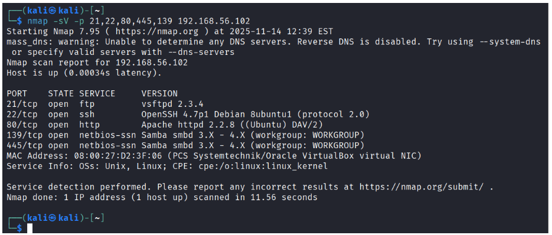

Simulação de Ataque de Força Bruta, utilizando a ferramenta Medusa no Kali Linux.

### Requisitos

- Software de Máquina Virtual (no caso será utilizado o VirtualBox, que você pode baixar clicando [aqui](https://www.virtualbox.org/wiki/Downloads)).
- VM Kali Linux (link para download [aqui](https://www.kali.org/get-kali/#kali-virtual-machines)).
- VM Metasploitable (link para download [aqui](https://sourceforge.net/projects/metasploitable/files/)).

### ⚠️ Observações

- Kali Linux: login e senha padrão → **kali**
- Metasploitable: login e senha padrão → **msfadmin**

### Técnicas utilizadas

- Password Spraying e Credential Stuffing

### Etapas

**1. Enumeração**

A primeira parte desta simulação é a enumeração, que consiste em descobrir quais serviços estão disponíveis no sistema alvo. Para isso é utilizado o comando **nmap**, que vai escanear as portas dos principais protocolos de rede como FTP, SSH, HTTP, HTTPS e SMB. O parâmetro **-sV** serve para identificar a versão do serviço que está rodando em cada porta:

Para isso, utilize o seguinte comando:

```bash
nmap -sV -p 21,22,80,445,139 192.168.56.102
```

Este comando vai mostrar qual o estado das portas como "**open**".



Se quiser validar se o protocolo FTP realmente está realmente aberto, basta executar o comando:

```bash
ftp 192.168.56.102
```

**2. Wordlist**

Conforme a imagem anterior, sabemos que o serviço está aberto mas não temos como saber qual login e senha correto. Diante disso, vamos criar duas Wordlists, uma contendo nomes de usuários e outra contendo senhas. 
**Wordlists** são arquivos com usuários e senhas possíveis. Para isso vamos utilizar os seguintes passos abaixo:

Comando para criar lista de **usuários**:

```bash
echo -e “user\nmsfadmin\nadmin\nroot” > users.txt
```

Comando para criar lista de **senhas**:

```bash
echo -e “123456\npassword\nqwerty\nmsfadmin” > pass.txt
```

**3. Efetuando o ataque**

Criada as wordlists, agora é hora de executar o **Medusa**, que vai simular combinações entre usuários e senhas. O comando é:

```bash
medusa -h 192.168.56.102 -U users.txt -P pass.txt -M ftp -t 6
```

Explicando os parâmetros:
- `-h 192.168.56.102`: define o host alvo. É o endereço IP da máquina que você quer testar.
- `-U users.txt`: informa o arquivo que contém a lista de usuários que serão testados.
- `-P pass.txt`: informa o arquivo que contém a lista de senhas que serão testadas.
- `-M ftp`: define o módulo (protocolo/serviço) que será atacado. Aqui, o ataque é contra o serviço FTP.
- `-t 6`: define o número de threads simultâneas. Em outras palavras: quantas tentativas paralelas o Medusa fará ao mesmo tempo.


